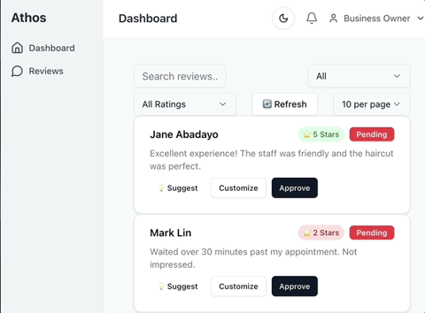

<pre>
 _______  _______  __   __  _______  _______ 
|   _   ||       ||  | |  ||       ||       |
|  |_|  ||_     _||  |_|  ||   _   ||  _____|
|       |  |   |  |       ||  | |  || |_____ 
|       |  |   |  |       ||  |_|  ||_____  |
|   _   |  |   |  |   _   ||       | _____| |
|__| |__|  |___|  |__| |__||_______||_______| 
</pre>



🧠 ATHOS – AI-Powered Review Response Automation

ATHOS is a full-stack, production-ready SaaS dashboard designed to help small businesses automate responses to customer reviews across platforms like Google. It uses AI (local or cloud LLMs) to generate thoughtful replies, notify businesses of negative reviews, and streamline reputation management.

🔧 Features
	•	✍️ AI-generated review replies (LLM-integrated)
	•	🛠 Toggle between real and mock API data (sandbox mode)
	•	📱 Responsive dashboard (mobile & desktop)
	•	⭐ Star rating filters for quick triage
	•	🔐 **Production-ready Google OAuth 2.0 integration** 
	•	🏢 **Multi-tenant SaaS architecture** with business isolation
	•	👤 **Real-time user authentication** with profile display
	•	🔄 **Automatic token refresh** and secure disconnection
	•	⚠️ Negative review alerts (coming soon)

🧰 Tech Stack
	•	Frontend: React + TypeScript + Tailwind + shadcn/ui
	•	Backend: .NET 6 Web API (Clean Architecture)
	•	AI: Local model via Ollama (barbershop-rev) or OpenAI
	•	Authentication: Google OAuth 2.0 (server-side flow)
	•	Database: SQLite with multi-tenant business isolation
	•	APIs: Google My Business API integration ready

## 🚀 Quick Start

### Prerequisites
- [.NET 6+ SDK](https://dotnet.microsoft.com/download)
- [Node.js 18+](https://nodejs.org/)
- [Git](https://git-scm.com/)

### ⚠️ Important: Run from Project Root
All commands below must be run from the project root directory (`/Athos/`), not from subdirectories.

```bash
# Verify you're in the correct directory
pwd
# Should show: /path/to/Athos (not /path/to/Athos/src/Dashboard)

# If you're in a subdirectory, navigate to project root:
cd ../..  # or cd /path/to/Athos
```

### Option 1: Single Command Start (Recommended)
```bash
# Install all dependencies (from project root)
npm run install:all

# Start both frontend and backend simultaneously (from project root)
npm run dev
```

### Option 2: Shell Script Alternative
```bash
# Make script executable (first time only)
chmod +x start-dev.sh

# Start development environment
./start-dev.sh
```

### Option 3: Manual Start (Two Terminals)
```bash
# Terminal 1 - Backend API (from project root)
npm run backend
# Or: dotnet run --project src/ReviewAutomation/Api/Athos.ReviewAutomation.Api.csproj

# Terminal 2 - Frontend React App (from project root)  
npm run frontend
# Or: cd src/Dashboard && npm run dev
```

### Available Commands (All from Project Root)
- `npm run dev` - Start both frontend and backend with colored output
- `npm run backend` - Start only the .NET API server
- `npm run frontend` - Start only the React development server  
- `npm run build` - Build both projects for production
- `npm run install:all` - Install dependencies for both frontend and backend
- `npm run dev:debug` - Start both services with verbose logging

### Common Issues
**Problem**: `npm run dev` only starts frontend (Vite)  
**Solution**: Make sure you're in the project root directory, not in `src/Dashboard/`

### Access Points
- 🎨 **Frontend Dashboard**: http://localhost:5173
- 📡 **Backend API**: http://localhost:7157  
- 📱 **Mobile Access**: http://10.0.0.22:5173 (auto-detected)

